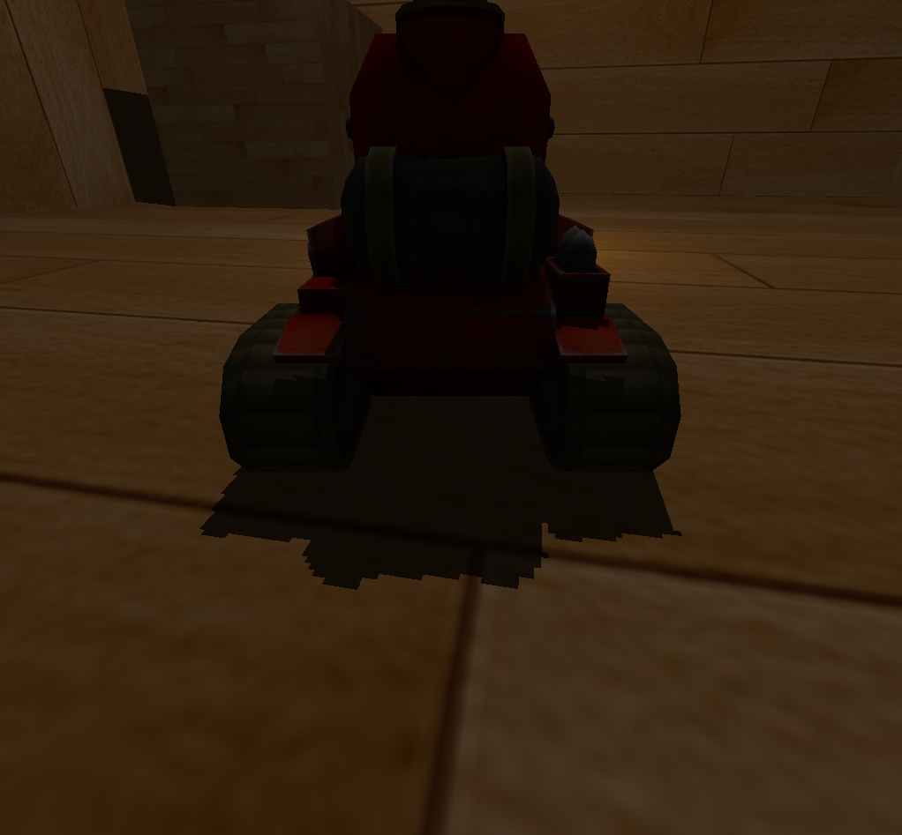

# 簡単な3Dシューティングゲーム

## 操作方法
上の矢印キーを押してタンクが進む。下の矢印キーを押してタンクが後退する。左と右の矢印キーを押してタンクが方向を変える。"space"キーを押してタンクが弾を発射する。すべての箱が壊されたあと、このゲームがクリアされた。

## シャドウをつける方法
このプログラムはOpenGLライブラリを利用して作成される。シャドウをつける方法は[LearnOpenGL](https://learnopengl.com/Advanced-Lighting/Shadows/Point-Shadows)のサイトを見てください。

# 简单的3D射击游戏

## 操作方法
按住向上的方向键坦克就会前进，按住向下的方向键坦克就会后退。按下左右方向键可以调整坦克的方向。按下空格键坦克就会发射子弹。全部的箱子都被破坏后，游戏就通关了。

## 添加阴影的方法
该程序使用了OpenGL库。具体可以查看[LearnOpenGL](https://learnopengl.com/Advanced-Lighting/Shadows/Point-Shadows)网站。

## Requirements
* glfw(version 2.20 or latter)
* OpenCV(version 4.40 or latter)
* stb_image(version 1.1 or latter)
* assimp(version 1.1.0 or latter)
* glm(vesion 2.2 or latter)
* glad(version 1.2.0 or latter)